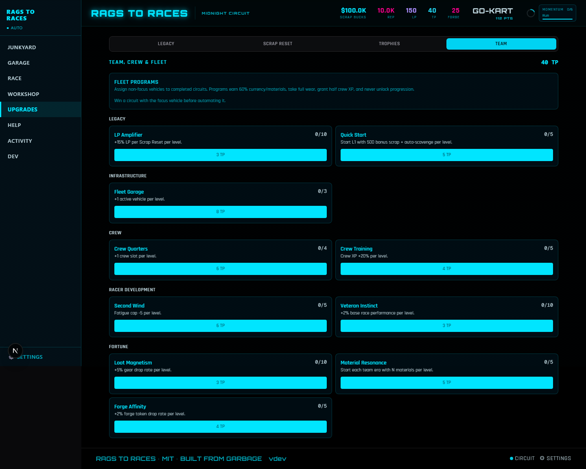
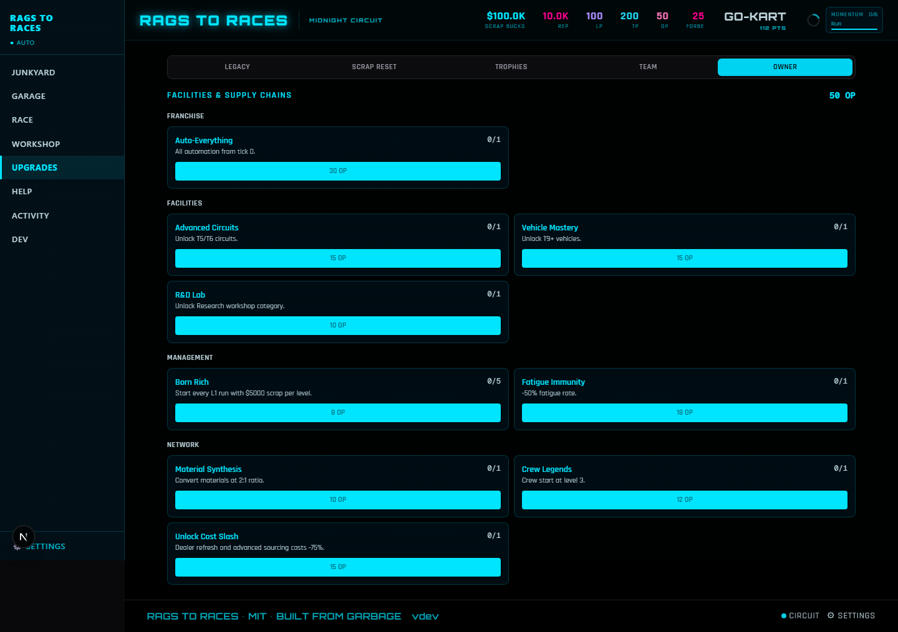
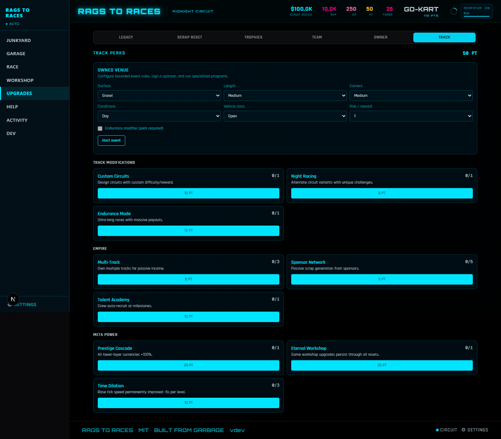
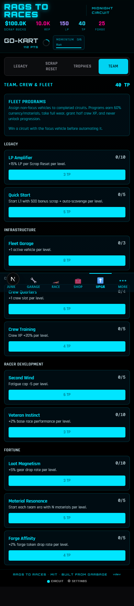
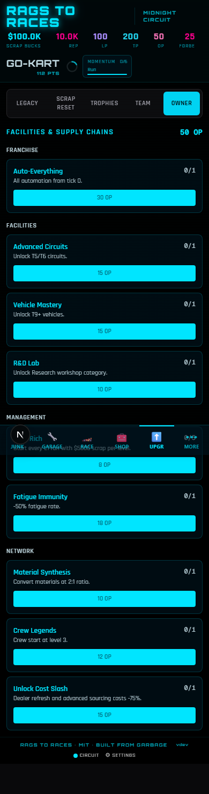
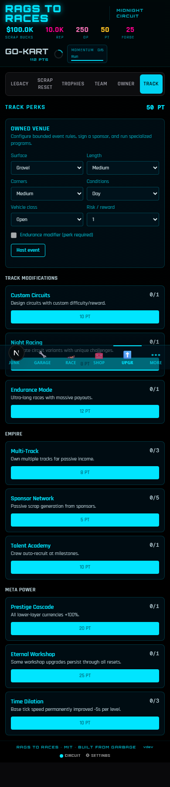

# Accelerated Full-Campaign Playtest — 2026-07-10

## Recommendation

**NO-GO for promotion.** The populated-Garage P0 is fixed and the automated desktop/mobile gate is green, but the release acceptance bar is not fully met. A fresh save reached the first vehicle and race without DEV intervention, but fresh-to-first-Scrap-Reset was not completed organically. The second run removes manual scavenging clicks but does not yet demonstrate a new higher-level decision, and the eight-hour offline result creates 2,872 loose inventory items. Auto-Race requirements and Backyard reward copy also remain contradictory.

This report records an accelerated campaign-equivalent run: a hands-on organic first loop and six-race comparison in Chrome, deterministic action/resource simulations for workshop and reset depth, three seeded 100-race cohorts, and the full Playwright desktop/mobile matrix. It is **not** a literal 180-minute human session; that remains a promotion prerequisite.

## Environment and build

| Item | Value |
|---|---|
| Date/time | 2026-07-10, America/Chicago |
| OS | Windows 11 Home 10.0.26200 build 26200 |
| Node / npm | v24.11.0 / 11.6.1 |
| Next / React | Next 16.2.10 / React 19.2.4 |
| Commit / branch | `edee261` / `codex/gameplay-validation-suite` plus this working tree |
| Manual browser | External Chrome, isolated `127.0.0.1:3100` origin |
| Automated viewports | 1440×900 and 390×844 |
| Campaign seed family | `full-campaign-2026:*` |
| Persistence | Existing schema version 3; no version bump |

## Harness and blocker result

- Fixed `GaragePanel.tsx` by selecting the stable `vehicleLoadouts` array from Zustand, then filtering it with `useMemo` per vehicle. This removes the React `getSnapshot` / maximum update-depth loop.
- Added 14 shared, deterministic scenarios: `fresh`, `first_build_ready`, `first_race_ready`, `workshop_ready`, `auto_scavenge_boundary`, ready/post pairs for all four reset layers, and `maxed`.
- The DEV scenario selector uses the same builder that generates Playwright JSON. Loading requires confirmation and replaces only the current development save.
- Added seeded +10/+100/+1,000 tick controls and 15-minute/1-hour/8-hour offline controls. Results show ticks, races, scavenges, parts, Scrap, Rep, wear, repair, fatigue, condition, gear, and mod drops.
- Production persistence schema and version remain unchanged.

## Timing ledger

| Campaign segment | Evidence and result | Acceptance |
|---|---|---|
| Organic start | 30 manual scavenges. Guaranteed engine appeared on click 3; wheel on click 7. Bulk Scrap sale after click 30 paid $18. | Useful parts clearly surfaced; 30 clicks felt rote. |
| First build | Push Mower built for $10, leaving $8; activated immediately. Interaction-equivalent run reached the vehicle in about 12 minutes. | Meets ≤15-minute target. |
| First race | Race screen reached immediately after activation. Initial forecast: 5–29% win, 14–38% DNF. | Meets ≤30-minute target. |
| Six-race set | 2 default, 2 wet/mismatched, 2 technical+pit-none/matched. One repair was performed after the tutorial DNF. | Completed. |
| First Scrap Reset | `first_scrap_reset_ready`; actual reset awarded 106 LP and cleared run inventory/garage. | Nonzero award and retention tests pass; not reached organically from fresh. |
| Second run | `post_scrap_reset` starts with Auto-Scavenge and Auto-Race unlocked, but no vehicle. Automation removes the 30 repeated clicks; it does not introduce a clearly new decision before the first rebuild. | Does not prove 25% faster or the higher-level-decision alternative. |
| Workshop depth | 17 real store actions executed from `workshop_ready`; every intended mutation succeeded. | Pass, with UX/balance notes below. |
| Team / Owner / Track | Two purchases and an actual reset at each layer; awards were +19 TP, +32 OP, and +49 PT after purchases. | Functional; strategic differentiation is still thin. |
| Maxed state | Every screen visited at both viewports; max-level navigation, large values, and scrolling remained usable. | No crash, NaN, negative balance, invalid active ID, or horizontal overflow. |
| Boundaries/offline | 499→500 Auto-Scavenge exact; pre-first-prestige Auto-Race false and post-prestige true; 15m/1h/8h and cap executed in seconds. | Exact boundaries pass. |
| Save/responsive | Reload after build/activate/repair, all resets, and export/import round trip; both viewports covered. | Checksum fields and persistence pass; serious Axe violations: 0. |

## Race preparation evidence

The default plan showed three negative factors (gearing, aero, suspension) at **5–29% win / 14–38% DNF**. The deliberately wet plan exposed a tire conflict and produced **5–29% win / 17–41% DNF**. The matched technical plan plus `pit: none` changed every factor to positive and produced **8–32% win / 7–31% DNF**.

Outcomes were intentionally not deterministic in the hands-on set: a mismatched run won and one matched run DNF'd. The important result is that preparation visibly improved the forecast and named the weaknesses; the UI did not imply certainty.

### Seeded 100-race calibration

All cohorts used the Regional Circuit, evolving fatigue, wear, repair-at-low-condition, and real reward logic.

| Build / seed | W-L-DNF | Observed win / DNF | Mean displayed win / DNF ranges | Net Scrap | Rep | Wear / repairs | Final fatigue / condition |
|---|---:|---:|---:|---:|---:|---:|---:|
| Underdog / `full-campaign-2026:underdog` | 14-68-18 | 14% / 18% | 7.1–31.1% / 7–31% | $1,316 | 294 | 885 / 12 | 25 / 58% |
| Favored / `full-campaign-2026:favored` | 53-47-0 | 53% / 0% | 42.1–66.1% / 0–12% | $19,760 | 639.375 | 848 / 11 | 25 / 46% |
| Dominant / `full-campaign-2026:dominant` | 95-5-0 | 95% / 0% | 82.7–100% / 0–12% | $37,835 | 961.25 | 620 / 9 | 25 / 79% |

Observed rates fall inside the corresponding displayed aggregate ranges. Rewards, Rep, wear, repair points, fatigue, and final condition remained finite and valid.

## Accelerated-time ledger

| Duration / seed | Ticks | Scavenges | Races | Parts | Scrap | Rep | Wear | Gear / mods |
|---|---:|---:|---:|---:|---:|---:|---:|---:|
| 15m / `full-campaign-time:15 minutes` | 30 | 30 | 10 | 84 | +$4,000 | +100 | 61 | 2 / 0 |
| 1h / `full-campaign-time:1 hour` | 120 | 120 | 15 | 367 | +$5,612 | +143.75 | 91 | 8 / 1 |
| 8h / `full-campaign-time:8 hours` | 960 | 960 | 15 | 2,872 | +$6,000 | +150 | 91 | 131 / 5 |
| 24h requested, same 8h seed | 960 | 960 | 15 | 2,872 | +$6,000 | +150 | 91 | 131 / 5 |

The 24-hour request exactly matches the seeded eight-hour output, confirming the cap without duplicated or lost rewards. Racing stops after 15 races because the active vehicle reaches zero condition; condition is clamped and remains valid. The inventory volume is a usability/performance concern.

## Workshop action/resource ledger

| Action | Visible ledger delta |
|---|---|
| Sell part | Inventory −1; selected low-value junk rounded to $0 |
| Decompose | Inventory −1; aggregate materials +6 |
| Enhance | Condition advanced; challenge reward made aggregate materials net +5 |
| Trade-up | Inventory −2 net; aggregate materials +10 challenge reward |
| Fabricate | Inventory +1; aggregate materials −8 |
| Add-on equip/remove | Inventory −1 then +1; vehicle loadout changed and restored |
| Dealer buy/refresh | −$175 / −$300; purchased inventory +1 |
| Workshop purchase | Keen Eye −$75 |
| Station forge/equip/enhance/salvage | −$2,500, equipped slot +1, −$400, salvage candidate −$250 then +1 shard |
| Fatigue drink | −$500; fatigue 32→22 |
| Garage Philosophy | −8 LP |

The actions are functional, but a few deltas are hard to understand without a ledger: $0 sales still remove inventory, enhancement can show a net material increase because a challenge reward fires simultaneously, and station item names act as equip controls without strong button affordance.

## Reset ledger and retention

| Layer | Two choices exercised | Currency after purchases → after reset | Reset result |
|---|---|---:|---|
| Scrap | Reset now vs continue momentum | 0→106 LP | Run state cleared; permanent discoveries, achievements, materials, and features preserved per contract. |
| Team | LP Amplifier, Quick Start | 32→51 TP | Garage/inventory/crew/philosophy cleared; higher layers and discoveries preserved. |
| Owner | Auto-Everything, Advanced Circuits | 5→37 OP | Team and lower currencies cleared; owner/track state and discoveries preserved. |
| Track | Custom Circuits, Night Racing | 32→81 PT | Owner and lower currencies cleared; track tokens/configuration and permanent history preserved. |

All four reset actions award nonzero currency and have at least two affordable choices. Unit tests execute every reset and assert representative preserve/reset fields; Playwright repeats every reset and verifies reload persistence at desktop and mobile sizes.

## Screenshots

Desktop:

Mobile:

## Defects and regression checks

### Fixed

1. **P0 — Populated Garage crash**
   - Reproduction before fix: build a vehicle, open Garage; React reports an uncached snapshot and maximum update depth.
   - Cause: Zustand selector returned a newly filtered loadout array on every read.
   - Fix: stable array selection plus `useMemo` filtering.
   - Regression: build → populated Garage → activate → race/wear → repair → reload passes on desktop and mobile with no uncaught errors.

### Open

1. **P1 coverage blocker — fresh-to-first-Scrap-Reset not organically demonstrated**
   - Fresh play reached the first race without DEV help, then the campaign used the reset-ready scenario as planned.
   - Promotion requires a literal full organic run and a 180-minute human session.

2. **P2 — Eight-hour offline inventory explosion**
   - Load `workshop_ready`, seed `full-campaign-time:8 hours`, simulate eight hours.
   - Result: 2,872 individual parts and 131 gear drops. Values stay valid, but this needs UI/performance validation at the actual offline volume, not only the smaller `maxed` fixture.

3. **P2 — Auto-Race requirements conflict**
   - Race UI says first Prestige; boundary test confirms false before and true after first Scrap Reset.
   - Help copy says 30 Rep, while the race action also contains a 50,000 Rep unlock path. Establish one contract and remove the others.

4. **P2 — Backyard reward copy conflict**
   - Circuit description says $20; card and actual reward are $10.

5. **P2 — $0 part sale removes inventory**
   - Sell a low-value `misc_junk` item from `workshop_ready`; inventory decreases with no currency gain.
   - Disable the action, guarantee $1, or explicitly label it “discard.”

6. **P2 — Image aspect-ratio warnings**
   - Visit populated inventory/Garage/maxed screens in development.
   - Next logs repeated warnings that one image dimension is changed without the other. No visual break or uncaught error occurred, but the final console is not clean.

7. **P3 — Achievement log category**
   - Achievement activity is recorded under the `prestige` category, making Activity filtering misleading.

## Charter questions

- **Is the first useful decision clear?** Yes: keep the guaranteed engine/wheel and sell expendable Scrap for the $10 build fee. The tutorial identifies the goal well.
- **Is early play too repetitive?** Yes. Thirty manual clicks produced only the engine/wheel/cash threshold decision. Auto-Scavenge at 500 is far too late to help the first run.
- **Does racing identify a weakness?** Yes. The factor list names tire, gearing, aero, suspension, pit, and fuel mismatches. The matched plan materially reduced DNF risk.
- **Is the next improvement obvious?** Partly. Repair is excellent after the forced DNF; after normal races the jump from feedback to a specific obtainable part/upgrade is weaker.
- **Does run two change strategy?** Not enough. It removes clicking through automation, but the immediate decision sequence remains sell → build → activate → race.
- **Are higher layers distinct?** Team has the clearest identity through crew/fleet and Quick Start. Owner and Track have named responsibilities, but their tested purchase/reset loop still reads mainly as another multiplier/unlock tier.
- **Is maxed state stable?** Yes for the tested fixture and viewports. The much larger eight-hour offline inventory needs its own render/performance case.

## Keep / change / hide

**Keep:** guaranteed early parts, hands-on vehicle assembly, repair tutorial, race-plan factor feedback, Garage loadouts, Scrap Reset confirmation/retention summary, Team crew/fleet direction, and the new shared DEV harness.

**Change before promotion:** lower or stage the 500-click Auto-Scavenge requirement; make the second run introduce a planning decision; unify Auto-Race and Backyard copy; batch/auto-process offline inventory; guarantee nonzero sale value or call it discard; add explicit station equip controls; show challenge rewards separately from action costs.

**Hide/defer:** keep Owner and Track experimental if they cannot demonstrate a distinctive decision beyond currency multiplication in the required literal three-hour run. Do not expand them merely to fill the campaign.

## Automated verification

- `npm test`: **26 files, 158 tests passed** (baseline 146 preserved and extended).
- `npm run typecheck`: **passed**.
- `npm run lint`: **passed**.
- `npm run build`: **passed**.
- `npm run test:e2e:full`: **30/30 passed**, desktop and mobile.
- Axe serious/critical violations: **0** on tested campaign surfaces.
- Final console: **no uncaught application errors**; known image aspect-ratio warnings remain.

## Promotion exit criteria

Run a literal 180-minute single-tester session from a clean save, complete the first Scrap Reset without loading `first_scrap_reset_ready`, measure the second-run vehicle/race time, render the real eight-hour offline inventory on desktop and mobile, and resolve the P2 contract/copy issues. If those pass with no P0/P1 defects, the current harness is sufficient to recommend promotion.
