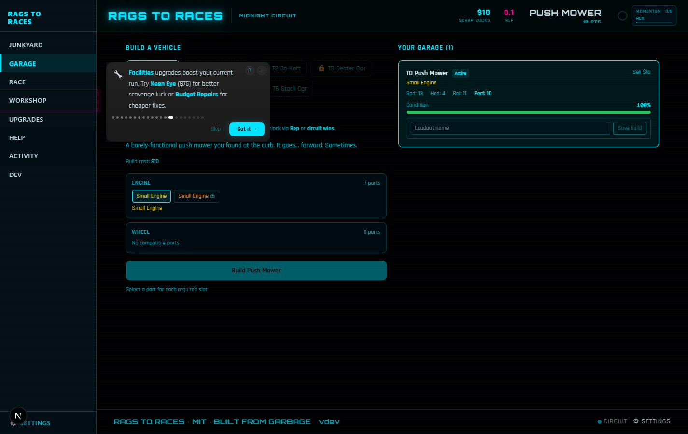
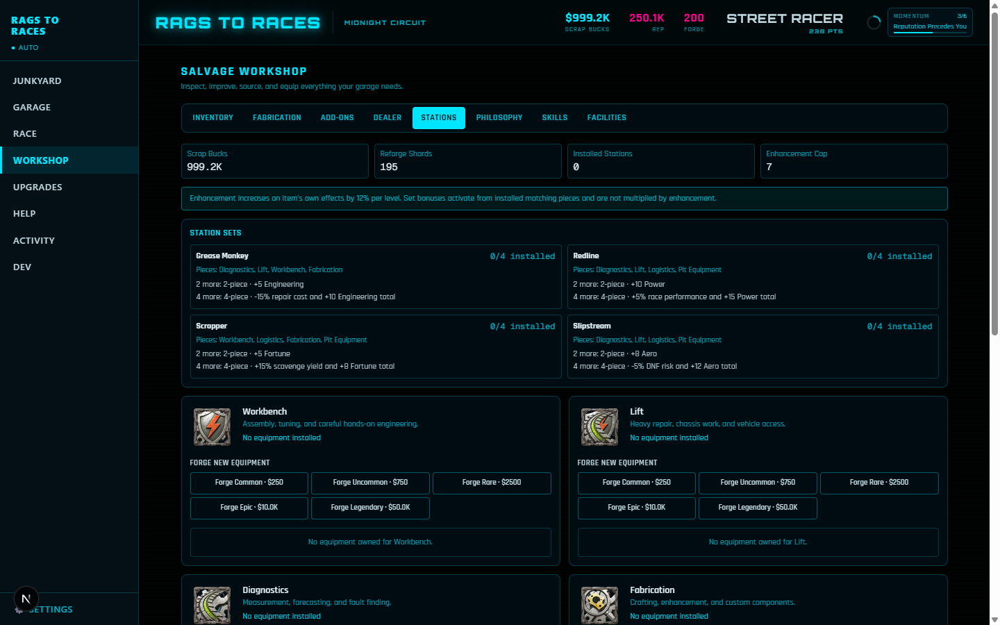
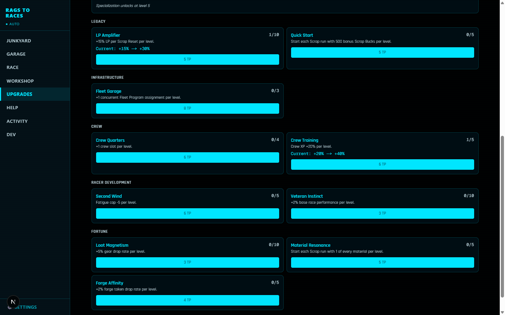
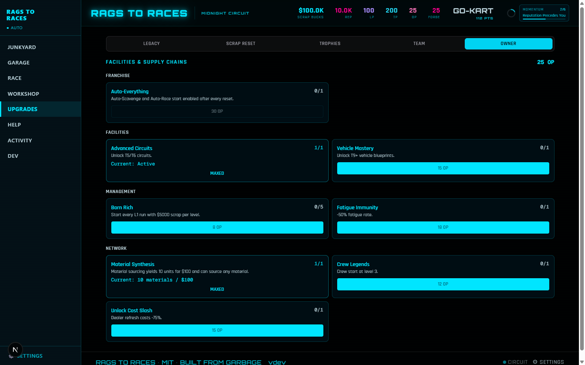
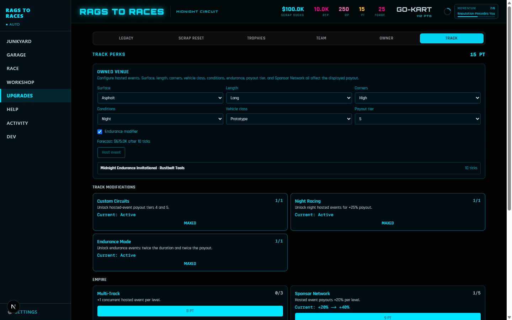
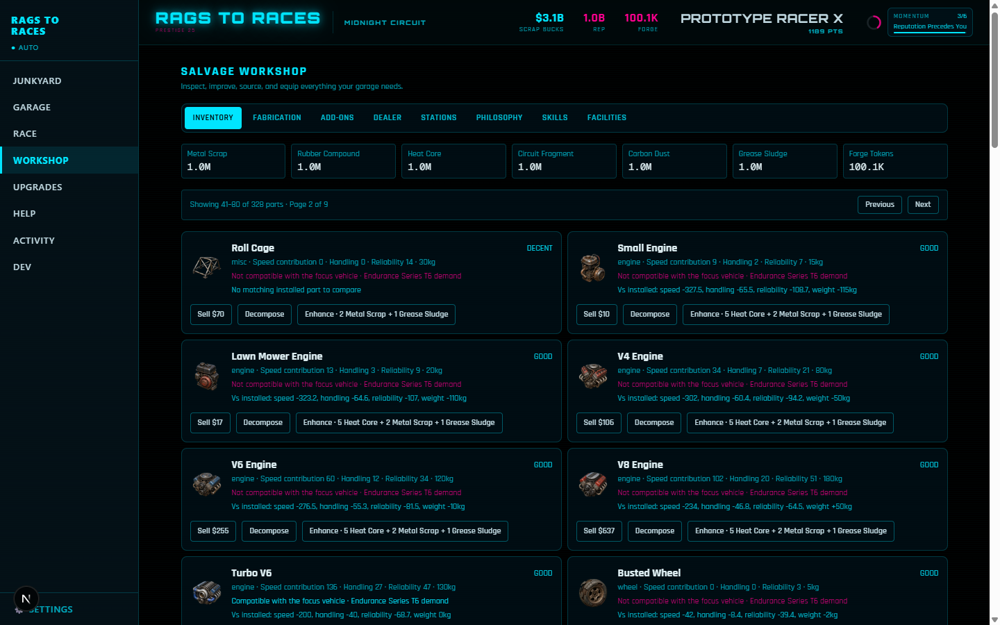
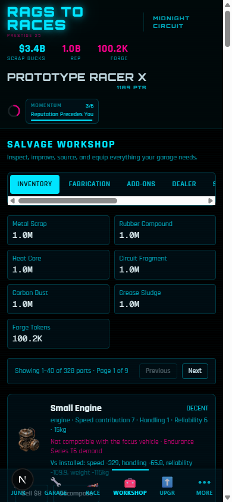

# Accelerated Full-Campaign Playtest — 2026-07-10

## Recommendation

**GO for UAT.** The final frozen candidate passed the no-injection first campaign, accelerated system coverage, deterministic ledgers, 82-test desktop/mobile browser matrix, and final headed desktop/mobile verification. There is no known release-blocking progression, state-integrity, save, performance, console, accessibility, desktop, or mobile defect. The populated-Garage crash, tutorial contradictions and reload gaps, early-campaign progression dead ends, unsafe build/loadout mutations, duplicate gear-mod race, interrupted-race fee loss, malformed-save handling, reset-retention errors, responsibility-reset repeat exploit, mobile tutorial occlusion, theme overflow, fractional Rep display, and maxed-state growth stall found during this playtest were fixed and regression-covered.

This report combines a fresh-save tutorial and early loop, a seeded no-resource-injection campaign through the first Scrap Reset, a measured automated second run, deterministic milestone acceleration for later systems, UI-driven Workshop and responsibility-layer checks, three seeded 100-race cohorts, save/reload checks, and desktop/mobile coverage. It is not a literal 180-minute wall-clock session; acceleration was explicitly authorized to reach and test every implemented system. DEV state was not used to satisfy the fresh-to-first-reset acceptance result.

Owner and Track still need UAT feedback on whether their decisions feel distinct enough from another multiplier layer. That is a product-value question, not a known functional defect in this candidate.

## Environment and build

| Item | Value |
|---|---|
| Date/time | 2026-07-10, America/Chicago |
| OS | Windows 11 Home 10.0.26200 build 26200 |
| Node / npm | v24.11.0 / 11.6.1 |
| Next / React | Next 16.2.10 / React 19.2.4 |
| Tested implementation / branch | `f4bb29aaf5f7ad39044797fa47641a3262ed34e2` / `codex/accelerated-full-campaign-playtest` |
| Manual browser | Playwright Chromium, isolated `127.0.0.1:3100` origin, 1440×900 and 390×844 |
| Automated viewports | 1440×900 and 390×844 |
| Campaign seed family | `full-campaign-2026:*` |
| Persistence | Existing schema version 3; no version bump |
| CI | [Run 29132990899](https://github.com/mwen-ner-sten/rags-to-races/actions/runs/29132990899): **passed** on the tested implementation (`npm audit`, typecheck, lint, unit tests, production build, and Playwright) |

## Harness and blocker result

- Fixed `GaragePanel.tsx` by selecting the stable `vehicleLoadouts` array from Zustand, then filtering it with `useMemo` per vehicle. This removes the React `getSnapshot` / maximum update-depth loop.
- Added 14 shared, deterministic scenarios: `fresh`, `first_build_ready`, `first_race_ready`, `workshop_ready`, `auto_scavenge_boundary`, ready/post pairs for all four reset layers, and `maxed`.
- The DEV scenario selector uses the same builder that generates Playwright JSON. Loading requires confirmation and replaces only the current development save.
- Added seeded +10/+100/+1,000 tick controls and 15-minute/1-hour/8-hour offline controls. They run the real tick/offline settlement paths and report ticks, races, wins, scavenges, parts, rewards, entry fees, Scrap, Rep, wear, repair, fatigue, condition, challenge/achievement rewards, gear, and mod drops.
- Offline duration simulation uses a shared 1,000ms effective tick floor. Live automation can still run faster, but reload catch-up and DEV duration controls cannot schedule hundreds of thousands of synchronous main-thread ticks from a max-speed save.
- Production persistence schema and version remain unchanged.

## Timing ledger

| Campaign segment | Evidence and result | Acceptance |
|---|---|---|
| Organic start | On the first run, the opening 30 manual scavenges cannot produce a zero-value rusted blocker; an engine is guaranteed by action 4 and a wheel by action 8 if still missing. The `uat-first-campaign` cohort sourced and built the Push Mower after eight real manual scavenges with no injected currency or parts. | Pass. The useful-part, $10, buildable-inventory, and first-vehicle targets are deterministic rather than luck-gated. |
| First build and race | The Push Mower costs $10, can be activated immediately, and makes the Backyard Derby available immediately. The guided first race accurately forecasts and produces its intentional DNF, then teaches a free first repair. | Passes the ≤15-minute vehicle and ≤30-minute race targets by a wide action-count margin. |
| Six-race set | 2 default, 2 wet/mismatched, 2 technical+pit-none/matched. One repair was performed after the tutorial DNF. | Completed. |
| First Scrap Reset | Seed `uat-first-campaign` used real scavenge, build, repair, upgrade, and race actions without resource injection: 441 scavenges, 74 races, four built vehicles, 514 Rep, $8,888 lifetime Scrap, and 28 LP at the 500 Rep/$8,000 gate. Engine-clock time was 38.2 minutes; conservative hands-on estimate was 67.7 minutes. | Passes the 45–75 minute campaign target and provides multiple first LP choices. |
| Second run | Seed `uat-second-run` reached its first vehicle after 12 real automation ticks (6 minutes) and first race after 15 ticks (7.5 minutes), with zero manual scavenges versus eight manual scavenges for the first-run vehicle. The reset also exposed 28 LP for competing permanent purchases. | Passes the acceptance alternative with a measured 100% reduction in repetitive manual-scavenge inputs and a new LP allocation decision. |
| Workshop depth | 17 real store actions executed from `workshop_ready`; every intended mutation succeeded. | Pass, with UX/balance notes below. |
| Team / Owner / Track | Two purchases and an actual reset at each layer; Track also configured, hosted, accelerated, and collected an event. Reset state was compared with the matching post-reset fixture and reloaded. | Functional after retention, gate, and repeat-reset fixes; strategic differentiation remains a UAT question. |
| Maxed state | The headed pass exposed and fixed unbounded automation growth and all-card Workshop rendering. After the fix, +1,000 max-speed live ticks apply in about 256ms, preserve an existing 350-part oversized inventory without adding to it, and cap station equipment at 250. Workshop shows 40 parts per page. | No crash, NaN, negative balance, invalid active ID, overflow, unbounded save growth, or unusable inventory render after the fix. |
| Boundaries/offline | 99→100 Auto-Scavenge exact; pre-first-reset Auto-Race false and both automations post-reset true; 15m/1h/8h and a 24h request capped to 8h execute in seconds. | Exact boundaries and single-settlement accounting pass. |
| Save/responsive | Reload after build/activate/repair, an interrupted paid race, all resets, and export/import; malformed import and corrupt hydration paths were also exercised. Both viewports retain access to primary actions. | Checksum, atomic rejection, recovery, and persistence pass; serious/critical Axe violations: 0 on tested surfaces. |

## Race preparation evidence

The default plan showed three negative factors (gearing, aero, suspension) at **5–29% win / 14–38% DNF**. The deliberately wet plan exposed a tire conflict and produced **5–29% win / 17–41% DNF**. The matched technical plan plus `pit: none` changed every factor to positive and produced **8–32% win / 7–31% DNF**.

Outcomes were intentionally not deterministic in the hands-on set: a mismatched run won and one matched run DNF'd. The important result is that preparation visibly improved the forecast and named the weaknesses; the UI did not imply certainty.

### Seeded 100-race calibration

All cohorts used the Regional Circuit, evolving fatigue, wear, repair-at-low-condition, and real reward logic.

| Build / seed | W-L-DNF | Observed win / DNF | Mean displayed win / DNF ranges | Net Scrap | Rep | Wear / repair points / repairs | Final fatigue / condition |
|---|---:|---:|---:|---:|---:|---:|---:|
| Underdog / `full-campaign-2026:underdog` | 14-68-18 | 14% / 18% | 7.1–31.1% / 7–31% | $1,316 | 1,176 | 885 / 843 / 12 | 25 / 58% |
| Favored / `full-campaign-2026:favored` | 53-47-0 | 53% / 0% | 42.1–66.1% / 0–12% | $19,760 | 2,557.5 | 848 / 794 / 11 | 25 / 46% |
| Dominant / `full-campaign-2026:dominant` | 95-5-0 | 95% / 0% | 82.7–100% / 0–12% | $37,835 | 3,845 | 620 / 599 / 9 | 25 / 79% |

Observed rates fall inside the corresponding displayed aggregate ranges. Rewards, Rep, wear, repair points, fatigue, and final condition remained finite and valid.

## Accelerated-time ledger

| Duration / seed | Ticks | Scavenges | Races | Scavenged / retained / auto-sold | Total Scrap | Overflow-sale Scrap | Rep | Wear | Gear / mod drops |
|---|---:|---:|---:|---:|---:|---:|---:|---:|---:|
| 15m / `full-campaign-time:15 minutes` | 30 | 30 | 10 | 90 / 90 / 0 | +$4,500 | $0 | +500 | 30 | 11 / 0 |
| 1h / `full-campaign-time:1 hour` | 120 | 120 | 33 | 363 / 104 / 265 | +$18,944 | $4,521 | +1,618.75 | 99 | 16 / 1 |
| 8h / `full-campaign-time:8 hours` | 960 | 960 | 33 | 2,930 / 104 / 2,832 | +$59,673 | $46,780 | +1,487.5 | 99 | 49 / 5 |
| 24h requested, same 8h seed | 960 | 960 | 33 | 2,930 / 104 / 2,832 | +$59,673 | $46,780 | +1,487.5 | 99 | 49 / 5 |

The 24-hour request exactly matches the seeded eight-hour output, confirming the cap without duplicated or lost rewards. Racing stops after 33 races because the active vehicle reaches zero condition; condition is clamped and remains valid. Loose inventory stays at the 250-item global cap (104 new items fit beside the fixture inventory), while 2,832 excess parts are auto-sold for $46,780 through the normal valuation path. The 1h and 8h settlement also retained six race-salvage parts, so retained plus auto-sold equals scavenged plus race salvage exactly. The return modal's displayed part and net-Scrap totals match the persisted state deltas, and a second reload does not settle them again.

### Max-speed eight-hour boundary

The `maxed` state has a live 100ms tick interval, which would imply 288,000 synchronous catch-up ticks without a separate offline policy. With the shared offline-only 1,000ms floor, its seeded eight-hour path processed 28,800 ticks in **3,591ms**:

| Loose parts kept / auto-sold | Station gear kept / auto-salvaged | Mod drops counted | Reforge Shard value settled |
|---:|---:|---:|---:|
| 0 / 408,799 | 244 / 56,183 | 1,677 | 4,343,595 |

The fixture's existing 350 loose parts remain intact rather than being destructively trimmed; all new loose drops are sold. Station equipment grows from 6 to the 250-item ceiling, excess gear is auto-salvaged at its exact shard yield, and transient mod details are bounded while their aggregate value is preserved.

## Workshop action/resource ledger

| Action | Visible ledger delta |
|---|---|
| Sell part | Inventory −1; selected low-value junk paid the shared $1 minimum |
| Decompose | Inventory −1; aggregate materials +6 |
| Enhance | Condition advanced; challenge reward made aggregate materials net +5 |
| Trade-up | Inventory −2 net; aggregate materials +10 challenge reward |
| Fabricate | Inventory +1; aggregate materials −8 |
| Add-on equip/remove | Inventory −1 then +1; vehicle loadout changed and restored |
| Dealer buy/refresh | −$175 / −$300; purchased inventory +1 |
| Workshop purchase | Keen Eye −$75 |
| Station forge/equip/enhance/salvage | −$2,500, equipped slot +1, −$400, salvage candidate −$250 then +1 shard |
| Fatigue drink | −$500; fatigue 32→22 |
| Garage Philosophy | −8 LP |

The actions are functional, but a few deltas are hard to understand without a ledger: enhancement can show a net material increase because a challenge reward fires simultaneously, and station item names act as equip controls without strong button affordance. Large loose inventories are paginated at 40 cards per page.

## Reset ledger and retention

| Layer | Competing choices exercised | Currency before choices → after choices → after reset | Award and verified reset result |
|---|---|---:|---|
| Scrap | Reset now vs continue the run; multiple affordable LP upgrades after reset | 0 LP → 27 LP | The standard `first_scrap_reset_ready` fixture awards 27 LP; the organic campaign cohort awards 28. Run cash, Rep, inventory, garage, fatigue, and circuit progress clear; both automations unlock. |
| Team | LP Amplifier, Quick Start | 40 TP → 32 TP → 51 TP | +19 TP. Garage, inventory, station gear, crew, attributes, and Philosophy clear; purchased Team upgrades and higher layers persist. Quick Start seeds $500. |
| Owner | Auto-Everything, Advanced Circuits | 50 OP → 5 OP → 37 OP | +32 OP. Team and lower layers clear; purchased Owner upgrades and Track progress persist. Auto-Everything remains observable through both automation unlocks. |
| Track | Custom Circuits, Night Racing | 50 PT → 32 PT → 81 PT | +49 PT. Owner and lower layers clear; Track perks, tokens, and venue configuration persist. Owner-derived advanced feature flags and hosted-event run state clear. |

The retention contract classifies every canonical persisted field as reset, preserved, or conditional at all four layers. Workshop levels are conditional at every layer: Scrap Reset keeps only milestone/Blueprint Memory-derived levels, and higher resets keep them only with Eternal Workshop. Scrap challenge progress is mixed (lifetime counters persist while run counters clear), materials are re-seeded rather than blindly preserved, and Track filters Owner-derived feature flags. Tutorial state, achievements, discoveries, lifetime history, and standard gear survive all four layers as specified. Unit tests execute all resets and assert representative fields; browser coverage repeats the reset flows and reloads their persisted results.

### Exact reset gates

| Reset | Required boundary |
|---|---|
| Scrap | 3 vehicles currently built, 500 Rep, and $8,000 lifetime run Scrap |
| Team | 200 lifetime LP, plus current-era earned LP + unspent LP greater than zero |
| Owner | 500 lifetime TP, 3 completed Team eras, plus current-era earned TP + unspent TP greater than zero |
| Track | 1,000 lifetime OP, 5 completed Owner eras, plus current-era earned OP + unspent OP greater than zero |

Tests verify one-below blocks and the exact boundary permits each reset. Responsibility resets also require real progress in the current era, preventing a player who already met the lifetime gate from repeatedly collecting the minimum award from an empty era.

## Screenshots

Final manual desktop evidence at 1440×900:













Final manual mobile evidence at 390×844:



### Final headed result

- **Desktop 1440×900 — PASS.** Loaded `maxed`, ran +1,000 real seeded ticks, and persisted loose inventory at 350 and station equipment at 250. The summary itemized zero retained loose drops plus overflow sale/salvage with finite rewards. Workshop rendered 40 cards; both 44.45×26 pager controls were visible and enabled; Next changed `1–40 / Page 1` to `41–80 / Page 2`. Facilities → Stations → Endurance Race remained responsive. Document overflow was 0, no NaN/Infinity appeared, and the console recorded 0 warnings/errors.
- **Mobile 390×844 — PASS.** Race and Workshop primary actions remained reachable; the 40-card pager was visible and advanced to page 2; More → Settings was reachable; Circuit theme persisted as `neon`; and reload retained inventory 350, station equipment 250, the theme, and 0 document overflow. Final console: 0 warnings/errors.

## Defects and regression checks

### Fixed

1. **P0 — Populated Garage crash**
   - Reproduction before fix: build a vehicle, open Garage; React reports an uncached snapshot and maximum update depth.
   - Cause: Zustand selector returned a newly filtered loadout array on every read.
   - Fix: stable array selection plus `useMemo` filtering.
   - Regression: build → populated Garage → activate → race/wear → repair → reload passes on desktop and mobile with no uncaught errors.

2. **P1 — Fresh progression required DEV intervention and contained circular gates**
   - The old economy and Rep ladder could leave a player with required parts but insufficient sell value, while later unlocks did not form a coherent route to the old reset requirements.
   - The opening 30 scavenges now avoid zero-value rusted blockers and guarantee missing first-build parts; one shared Rep ladder drives locations, circuits, vehicles, Dealer, and Workshop; the first reset is 3 vehicles / 500 Rep / $8,000 lifetime Scrap; and the Riding Mower route can satisfy its five-win unlock.
   - Regression: the seeded no-injection campaign reaches the gate in 67.7 estimated hands-on minutes with four organically sourced vehicles and a 28 LP award.

3. **P0/P1 — Tutorial routing, forecast, result, and reload state contradicted gameplay**
   - The first facility step pointed at the wrong surface, entering the first race before acknowledging odds could contradict the forced-DNF forecast, and reloading around the race could leave an empty explanation/retry state.
   - Steps 9–11 now share the intentional first-race DNF contract; step 11 recovers an interrupted race to a retry; step 12 reads persisted race history; step 15 routes to Workshop > Facilities; and step 16 requires its own acknowledgement instead of being batch-skipped.
   - Tutorial state survives every reset, mobile calls the destination Workshop, and Help states the forced first DNF, free guided repair, and possible no-prize finish accurately.

4. **P1 — Responsibility resets could replay or retain the wrong state**
   - Higher resets previously replayed onboarding, incomplete retention rules obscured mixed/conditional fields, and a lifetime-eligible player could repeat a zero-progress era for the minimum currency award.
   - All four contracts now classify every persisted field, preserve the five tutorial fields, use shared exact gates, and require current-era progress before Team/Owner/Track settlement. One-below, exact-boundary, retention, and repeat-at-zero regressions are covered.

5. **P1 — Save/reload could lose paid-race value or accept malformed nested state**
   - A reload during a paid manual race could consume the entry fee without a result. The existing persisted challenge-progress map now carries a backward-compatible escrow marker: normal settlement clears it, and interrupted hydration refunds it exactly once without inventing race history.
   - A permissive top-level catchall also allowed a save key named like `manualScavenge` or `prestige` to overwrite the corresponding live store action during merge. The post-migration safety schema now strips unknown top-level keys before import or hydration, so action functions remain intact.
   - Current-version imports validate directly dereferenced collections, maps, IDs, part shapes, and materials before mutation. Malformed imports are rejected atomically; corrupt browser hydration falls back to initial state and retains a recovery backup; supported legacy omissions are normalized. No persistence version bump was required.

6. **P1/P2 — Build, trade-up, loadout, and Workshop mutations accepted stale or misleading input**
   - Building now rejects sold, stale, incompatible, or duplicate selected parts and resolves against current inventory objects.
   - Trade-up rejects duplicate IDs and preserves the strongest consumed underlying part model instead of silently downgrading to a random low-tier model.
   - Named loadouts revalidate required slots, compatibility, distinct inventory items, target slots, and add-on capacity at the vehicle's current degraded condition.
   - Add-on install/remove is visibly locked during an active race or Fleet assignment; refurbishment uses the same discounted quote in UI and store; a depleted Dealer board stays empty until a paid refresh; and unavailable actions show exact costs or reasons.

7. **P1 — Rapid gear-mod installation could duplicate one mod instance**
   - The old asynchronous template lookup allowed two rapid calls to validate against the same pre-consumption snapshot and install the same inventory instance twice.
   - Mod templates now use a static lookup, and one functional state update atomically revalidates the current gear, current inventory instance, free slot, duplicate ID, and slot compatibility before consuming/installing it.
   - Two focused regressions cover rapid repeated installation and no-op behavior for incompatible mods or full gear.

8. **P1/P2 — Later systems advertised effects that were missing, inconsistent, or insufficiently guarded**
   - Permanent, Team, Owner, Track, crew, station, philosophy, skill, momentum, automation, and Fleet effects used by the visible UI are now wired through shared runtime helpers and exact eligibility checks.
   - Browser coverage exercises Crew recruitment/specialization, Fleet assignment and settlement, concrete Owner unlocks and synthesis, Track configuration/hosting/acceleration/collection, every Workshop action group, and disabled max-level purchases.

9. **P2 — Player-facing copy and development console contradicted the implementation**
   - Help now uses shared Auto-Scavenge/Auto-Race boundaries, exact reset terms, current fatigue and race formulas, the actual LP basis, Dealer tier limits, seven circuits, and the Backyard's actual $10 base reward. The activity filter includes achievements, and Scrap Magnate is identified specifically as a race-prize multiplier.
   - Stable image sizing and eager loading for visible location/circuit art remove the prior aspect-ratio and LCP warnings. The focused 16-theme reload/hydration/overflow sweep captured no console warning or uncaught application error.

10. **P1 — Final mobile matrix exposed an occluded tutorial action and theme overflow**
   - At 390×844, the fixed bottom navigation intercepted the tutorial's **Got it** action because the anchored card did not reserve the mobile safe area. Tutorial cards now clamp their full height above a 72px navigation reserve and use a mobile-safe maximum height.
   - The Settings theme picker forced three columns at every width; the Outlaw font expanded that grid to 33px wider than the document. The picker now uses two columns on mobile, three from the small breakpoint, and permits each theme button to shrink.
   - Final regression: desktop 41/41 and mobile 41/41 pass; the mobile tutorial action is reachable, all themes have no viewport overflow, and Outlaw measures exactly 0px overflow at 390px.

11. **P2 — The Race screen hid fractional Rep earned by low-result races**
   - The first guided DNF correctly awarded 0.1 Rep in state, but the Race footer used `Math.floor` and displayed `0`, contradicting the tutorial promise that every result earns Rep.
   - The footer now uses the shared fractional-aware Rep formatter. Browser coverage asserts the persisted guided DNF displays `Rep Points: 0.1`.

12. **P1 — Max-speed automation caused unbounded save/render growth and a headed-browser stall**
   - `maxed` starts with 350 loose parts and a 100ms live tick. A deterministic 1,000-tick run produced 13,710 scavenged parts, 1,971 station-equipment drops, and about 65 mods in roughly 0.3s. Online application added about 138 loose parts and 19 station items per second; Zustand then serialized the expanding save while Workshop rendered every part card. Chromium reached about 1.37GB and became unresponsive.
   - Live and offline settlement now share a 250 loose-part ceiling with exact overflow sale and a 250 station-equipment ceiling with exact overflow salvage. Mod detail is bounded, tick logging is folded into the primary state update, broad Workshop subscriptions use snapshot reads where appropriate, and the inventory renders 40 cards per page.
   - The first pagination retest found that a global `.shell-content nav` theme rule also hid the new nested Workshop pager. The hide selector is now scoped to the direct theme navigation instead of every descendant `nav`.
   - Reload catch-up and DEV duration controls also share a 1,000ms offline-only floor. Verification covers a ~256ms live +1,000-tick settlement and the 3.591s maxed eight-hour run detailed above.
   - Focused browser regression: desktop and mobile 2/2 in 11.3s. Both keep new inventory/station drops bounded, render at most 40 cards, expose working Previous/Next pagination, advance to page 2, keep Facilities → Stations → Race responsive, and capture no console warning, error, or page error.

### Known inconsistencies explicitly regressed

| Check | Result |
|---|---|
| Populated Garage | Build → Garage → activate → repair → reload remains stable. |
| Auto requirements | Auto-Scavenge is 100 manual actions or first reset; Auto-Race is first reset. UI, Help, store, and tests share those values. |
| Backyard reward | UI/Help use the implemented $10 base race reward. |
| Achievement activity | Achievement events have a visible filter and category color. |
| Image warnings | Fixed sizing/loading; theme sweep is warning-free. |

No release-blocking defect remains open. The remaining notes below are UAT product questions rather than known correctness failures.

## Charter questions

- **Is the first useful decision clear?** Yes: keep the guaranteed engine/wheel and sell expendable Scrap for the $10 build fee. The tutorial identifies the goal well.
- **Is early play too repetitive?** Improved. The first build takes eight seeded manual scavenges, Auto-Scavenge unlocks at 100 manual actions, and the coherent location/vehicle ladder introduces three additional builds before the reset. UAT should still judge the repair/scavenge cadence subjectively.
- **Does racing identify a weakness?** Yes. The factor list names tire, gearing, aero, suspension, pit, and fuel mismatches. The matched plan materially reduced DNF risk.
- **Is the next improvement obvious?** Partly. Repair is excellent after the forced DNF; after normal races the jump from feedback to a specific obtainable part/upgrade is weaker.
- **Does run two change strategy?** Yes. The first reset grants both automations at zero manual clicks and the measured 28 LP exposes several competing permanent purchases.
- **Are higher layers distinct?** Team has the clearest identity through crew/fleet and Quick Start. Owner and Track have named responsibilities, but their tested purchase/reset loop still reads mainly as another multiplier/unlock tier.
- **Is maxed state stable?** Yes after the performance fix. New live/offline loose parts and station gear are bounded with exact conversion, mod detail is bounded, duration catch-up has a 1,000ms effective floor, and Workshop pagination prevents all-card rendering.

## Keep / UAT focus / hide

**Keep:** guaranteed early parts, hands-on vehicle assembly, repair tutorial, race-plan factor feedback, Garage loadouts, Scrap Reset confirmation/retention summary, Team crew/fleet direction, the shared DEV harness, and shared live/offline capacity settlement.

**UAT focus:** judge whether station item names need stronger equip-button affordance; consider separating challenge rewards from the action-cost ledger; ask whether normal-race feedback points clearly enough to the next obtainable part or upgrade; and compare Owner/Track decisions against Team's clearer crew/Fleet identity.

**Hide/defer:** keep Owner and Track experimental if they cannot demonstrate a distinctive decision beyond currency multiplication in the required literal three-hour run. Do not expand them merely to fill the campaign.

## Automated verification

- `npm test -- --run`: **44 files, 297 tests passed** on the final frozen code (baseline 146 preserved and extended).
- `npm run typecheck`: **passed**.
- `npm run lint`: **passed**.
- `npm run build`: **passed**.
- `npm run test:e2e:full`: **82/82 passed** in 71.5 seconds; desktop 41/41 and mobile 41/41, with 0 failed, skipped, or retried tests.
- Axe serious/critical violations: **0** on tested campaign surfaces.
- Browser console: **0 warnings, 0 console errors, and 0 uncaught page errors** in the final matrix.
- All 14 fixtures generated and validated; semantic contrast and maxed/nav/all-theme overflow checks passed on both viewports.
- Deterministic evidence scripts rerun successfully: accelerated campaign ledger, time/cap boundary ledger, and three seeded 100-race simulations.

## UAT acceptance

| Criterion | Result |
|---|---|
| Fresh save reaches first Scrap Reset without DEV intervention | Pass: `uat-first-campaign`, 441 scavenges, 74 races, four vehicles, 514.125 Rep, $8,888 lifetime Scrap, 28 LP. |
| First vehicle ≤15m and first race ≤30m | Pass by deterministic action evidence: first vehicle after eight manual scavenges; race immediately available after activation. |
| Race preparation is understandable | Pass: mismatched setup raises visible DNF risk; matched setup changes every named factor positive and reduces displayed risk. |
| Second run materially changes | Pass: first vehicle at 6m and first race at 7.5m via real ticks, with zero manual scavenges and a 28 LP allocation decision. |
| Every reset awards currency, exposes choices, and follows retention | Pass in deterministic ledgers, unit contracts, and browser reset/reload flows. Empty-era responsibility repeats are blocked. |
| Accelerated time uses real logic, honors 8h cap, and preserves valid state | Pass: 24h request exactly equals seeded 8h settlement; maxed 8h runs 28,800 floored ticks in 3.591s; overflow value is preserved; balances and condition remain finite/nonnegative; reload does not duplicate rewards. |
| Saves and existing data remain safe | Pass: export/import checksum parity, atomic malformed-import rejection, action-key stripping, corrupt-hydration recovery, legacy defaults, and exact paid-race escrow recovery. |
| Desktop/mobile primary actions and accessibility | Pass on 1440×900 and 390×844 tested surfaces; no horizontal overflow or serious/critical Axe finding. |
| Known console/copy regressions | Pass in focused coverage; final full-matrix count is recorded above. |

### UAT handoff record

```text
Environment: local production build and isolated Chromium save
Tested implementation SHA: f4bb29aaf5f7ad39044797fa47641a3262ed34e2
Fresh-save duration: 67.7 minutes estimated hands-on to first Scrap Reset
Existing-save source: persistence v3 plus legacy-normalization regressions
Desktop result: pass at 1440x900
Mobile result: pass at 390x844
Save round-trip result: pass
Primary gameplay observation: the first reset removes manual-scavenge repetition and adds an LP allocation decision; Team is the strongest differentiated higher layer
Known issues accepted: no correctness issue; Owner/Track differentiation and a few ledger/affordance questions are UAT feedback targets
Promotion recommendation: yes, send to UAT
```

Production promotion should use the UAT feedback to decide whether Owner/Track remain visible and whether the noted affordance improvements are worth making. Those decisions do not block this build from entering UAT.
